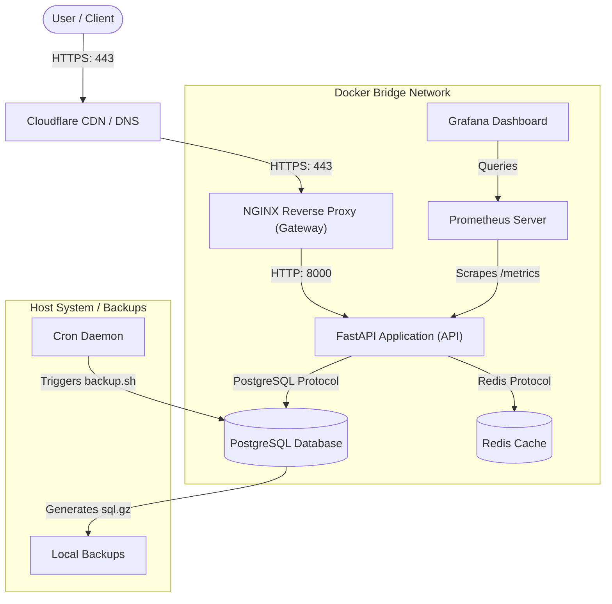

# Production-Ready FastAPI AI/Backend Application

This repository contains a production-grade, containerized AI/backend application built with **FastAPI**, **PostgreSQL**, **Redis**, and **Nginx**. The system is designed for high availability, security, continuous delivery, and full observability.

---

## 🏗️ System Architecture



For detailed setup instructions, including VPS hardening, UFW firewalls, Fail2ban, and Let's Encrypt SSL configurations, refer to the [DEPLOYMENT.md](file:///e:/imp/all%20coding/fastapi-production/DEPLOYMENT.md) guide.

---

## 🚀 Key Features & Requirements Met

### 1. Secure Containerization (`Dockerfile`)
*   **Multi-Stage Build**: Keeps the runner image small (based on `python:3.10-slim`) and removes compilation bloat.
*   **Non-Root Security**: Runs under a dedicated `appuser` system account to block root-escalation attacks.
*   **Built-in Health Check**: Executes an internal Python-based liveness test without requiring external tools like curl/wget.

### 2. Docker Compose Orchestration (`docker-compose.yml`)
*   **Resource Limits**: Restricts CPU and Memory allocations for database, cache, proxy, and app services.
*   **Log Rotation**: Restricts container log files to 10MB (max 3 files) using the `json-file` driver to prevent disk exhaustion.
*   **Isolated Databases**: PostgreSQL and Redis expose no public ports to the host system and communicate strictly over a private bridge network.

### 3. Nginx Gateway & Proxy Gateway (`nginx/nginx.conf`)
*   **Security Headers**: Implements HSTS, CSP, X-Frame-Options, and X-Content-Type-Options, and hides the Nginx server version.
*   **Dynamic DNS Resolution**: Uses variables in `proxy_pass` to query the Docker resolver (`127.0.0.1:11`) every 10 seconds. This avoids startup failures if the API is offline and handles container IP changes.
*   **Rate Limiting**: Limits requests to 10 req/sec (with a burst buffer of 20) to prevent abuse.

### 4. GitHub Actions CI/CD Pipeline (`.github/workflows/deploy.yml`)
*   **Automated Testing**: Spins up Postgres and Redis sidecar service containers inside the runner to execute integration tests before compilation.
*   **Zero-Downtime Rolling Update**: Configures Docker Compose's `order: start-first` update policy. GitHub Actions deploys new API container versions, waits for health checks to pass, and terminates old containers seamlessly.

### 5. AI/LLM Integration (`app/main.py`)
*   **Text Summarization Endpoint**: Features a `/ai/summarize` endpoint that accepts blocks of text, executes extractive sentence scoring, and simulates processing latency (500ms).
*   **Caching & DB Logging**: Computes SHA256 hashes of text to fetch/cache summaries in Redis (1-hour TTL) and logs request history in PostgreSQL (`AISummary` model).

### 6. Monitoring Pipeline (Prometheus + Grafana)
*   **Metrics Collection**: App instrumentation exposes metrics at `/metrics`. Prometheus scrapes stats every 5 seconds.
*   **Secure Dashboards**: Grafana is bound to localhost (`127.0.0.1:3000`) for security. Access is gained via an SSH tunnel (`ssh -L 3000:localhost:3000 deploy@server_ip`).

### 7. Automated Backups (`scripts/backup.sh`)
*   **Gzip Dumps**: Nightly cron-scheduled Postgres dumps are piped directly to gzip to save space.
*   **Harden Permissions**: Restricts backup files to owner-read-only (`chmod 600`) and purges backups older than 7 days.

---

## 🛠️ Getting Started (Local Development)

### 1. Clone the repository and navigate inside:
```bash
git clone https://github.com/DileepKushwah/fastapi-production.git
cd fastapi-production
```

### 2. Configure environment defaults:
Rename or create a `.env` file in the root directory:
```env
POSTGRES_DB=appdb
POSTGRES_USER=appuser
POSTGRES_PASSWORD=StrongPass123
REDIS_PASSWORD=RedisPass123
SECRET_KEY=my-super-secret-key-change-this
DEBUG=true
ALLOWED_ORIGINS=["*"]
```

### 3. Spin up the stack:
```bash
docker compose up -d --build
```

### 4. Verify local running services:
*   **FastAPI API**: [http://localhost:8000/docs](http://localhost:8000/docs) (Swagger UI)
*   **Nginx Proxy Gateway**: [http://localhost/health](http://localhost/health)
*   **Prometheus**: Exposed internally on port `9090`.
*   **Grafana**: Securely access at [http://localhost:3000](http://localhost:3000) (default credentials: `admin` / `admin_change_me`).

### 5. Running local tests:
```bash
pytest -v tests/
```

---

## 📂 Repository File Structure

```text
├── .github/
│   └── workflows/
│       └── deploy.yml          # CI/CD test, build, and deploy pipeline
├── app/
│   ├── cache.py               # Redis connection manager
│   ├── config.py              # Pydantic Settings & validation
│   ├── database.py            # SQLAlchemy async engine & sessionlocal
│   ├── main.py                # FastAPI core, endpoints, middleware, and structlog
│   ├── models.py              # SQLAlchemy DB schemas (Item, AISummary)
│   └── schemas.py             # Pydantic validation schemas
├── nginx/
│   └── nginx.conf             # Hardened Nginx reverse proxy configuration
├── prometheus/
│   └── prometheus.yml         # Prometheus metrics scraper config
├── scripts/
│   └── backup.sh              # Gzipped postgres database backup script
├── tests/
│   └── test_main.py           # Pytest integration tests
├── .env                       # Local environment variables
├── .gitignore                 # Excluded directories
├── Dockerfile                 # Multi-stage secure Docker configuration
├── docker-compose.yml         # Local & Production orchestration
├── pytest.ini                 # Pytest asyncio settings configuration
└── requirements.txt           # Main python dependency manifest
```
